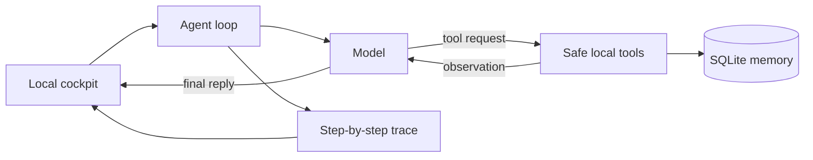

# Agent System Mini

**A small, readable agent system: loop + tools + memory + trace.**

Agent System Mini is a from-scratch learning build for seeing what happens inside one agent
turn. It is intentionally smaller than a framework and safer than a general-purpose
computer-use agent. The default demo needs no API key.


## Why this exists

Most agent demos show only the final answer. This one makes the mechanism visible:

1. the model reasons about the task;
2. it requests a registered tool;
3. the tool returns structured data;
4. the result goes back into working context;
5. the loop repeats until the model replies;
6. memory and the full trace persist in one SQLite file.

The architecture was inspired by readable agent projects such as
[Waku](https://github.com/ShenSeanChen/waku-agent), but this repository was implemented from
scratch with a narrower scope and no copied source.

## Run it in two minutes

Requires Python 3.11+.

```bash
git clone https://github.com/LobsterQBA/agent-system-mini.git
cd agent-system-mini
python -m agent_system
```

Open [http://127.0.0.1:8787](http://127.0.0.1:8787).

Try:

> Calculate 17 × 23 and remember the result as launch score.

Then restart the server and ask:

> What do you remember about launch score?

The answer survives because `.agent-mini/state.db` is the source of truth.

## Local API contract

The cockpit calls a local JSON API, which is also useful when trying the agent from a script. Requests must use `Content-Type: application/json`; other media types receive HTTP 415.

```bash
curl -X POST http://127.0.0.1:8787/api/run \
  -H 'Content-Type: application/json' \
  -d '{"message":"Calculate 8 * 9","mode":"demo"}'
```

`message` must be a non-empty string of at most 4,000 characters. Invalid requests return
HTTP 400 before an agent turn, model call, or trace entry is created. The only supported modes
are `demo` and `live`; `live` additionally requires `AGENT_API_KEY` and `AGENT_MODEL`.

## The four pieces



| Piece | What it does | Main file |
| --- | --- | --- |
| Loop | reason → act → observe, with a hard iteration limit | `agent_system/agent.py` |
| Tools | calculator, local time, remember, recall | `agent_system/tools.py` |
| Memory | durable facts and a ledger of turns | `agent_system/memory.py` |
| Trace | records every decision and renders it in the cockpit | `agent.py` + `static/app.js` |

Read [`docs/architecture.md`](docs/architecture.md) for the turn lifecycle and constraints.

## Demo mode and Live mode

**Demo mode** is the default. It uses a small deterministic planner so the repository works
immediately and the tool loop is reproducible. It makes no model request.

**Live mode** is optional. It uses an OpenAI-compatible function-calling model:

```bash
python -m venv .venv
source .venv/bin/activate
pip install -e '.[live]'
cp .env.example .env
# Add AGENT_API_KEY and AGENT_MODEL to .env
agent-mini
```

The key stays in the Python process and is never sent to the browser. In live mode, the model
provider receives the instruction, working messages, tool schemas, and tool results. Do not put
sensitive data into a hosted model unless its data policy fits your use case.

## Safety boundary

This project deliberately does **not** include shell access, browser control, email, messaging,
calendar writes, or arbitrary filesystem tools.

- The server binds to `127.0.0.1`.
- Calculator expressions are parsed with a restricted AST, never `eval`.
- Only registered functions can be called.
- Tool exceptions become structured observations instead of crashing the loop.
- Every turn has a maximum of six model iterations.
- Local runtime data and secrets are gitignored.

This is a learning and portfolio project, not a production security boundary.

## Verify it

```bash
python -m venv .venv
source .venv/bin/activate
pip install -e '.[dev]'
pytest -q
ruff check .
```

The tests cover the arithmetic sandbox, durable memory, multi-tool looping, iteration guardrail,
and local HTTP API.

## Project map

```text
agent_system/
  agent.py       # one complete agent turn
  models.py      # deterministic demo + optional live adapter
  tools.py       # registry and four safe tools
  memory.py      # SQLite persistence
  server.py      # localhost API + static cockpit
  static/        # framework-free interface
tests/           # deterministic behavior and API tests
```

## License

MIT
