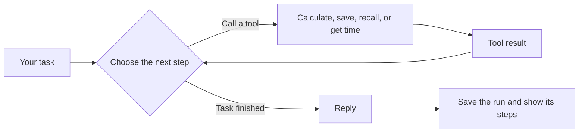
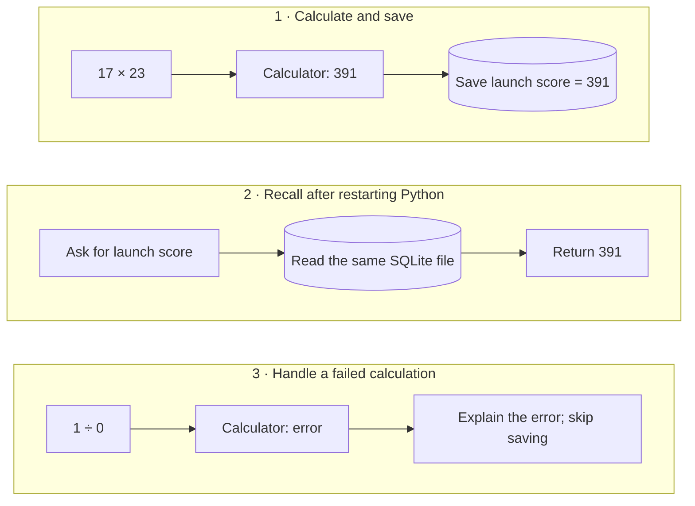

# Loop Agent

A small Python app that shows how an agent uses tools to finish a task.

Ask it to **calculate 17 × 23 and save the result**. It runs the calculator, stores `391`
in SQLite, and shows each tool call and result. Restart the app and ask for the value again:
it is still there.

I built this to understand the loop behind a tool-using agent: choose an action, run it,
read the result, and decide what to do next. The core loop is in
[agent.py](agent_system/agent.py).

**[Try the browser demo →](https://lobsterqba.github.io/loop-agent/)**

The browser demo replays three recorded runs: calculate and save, recall after a restart,
and handle a failed calculation. Run locally to enter your own tasks.

[](https://github.com/LobsterQBA/loop-agent/actions/workflows/ci.yml)

[](https://lobsterqba.github.io/loop-agent/)

## The loop at a glance



The planner uses fixed rules in Demo mode or a model in Live mode. The loop stops after
six planner calls by default if it has not finished.

## Three examples



These are the fixed-rule demo paths. The browser demo lets you open the recorded calls
and results for all three. Live mode makes its own tool choices.

## Try it locally

Requires **Python 3.11+**. The default demo needs no extra packages or API key.

```bash
git clone https://github.com/LobsterQBA/loop-agent.git
cd loop-agent
python3 -m agent_system
```

Open [localhost:8787](http://127.0.0.1:8787) and try the three examples:

1. **Calculate + remember:** run the prefilled task. The answer is `391`. Expand the steps
   to see the calculation and the saved value.
2. **Recall memory:** stop the server with Ctrl+C, restart it from the same directory,
   and run the recall example. It retrieves `launch score: 391` from SQLite.
3. **Try a failure:** division by zero returns an error without saving an invalid result.

Demo mode follows a few fixed rules. Live mode connects an LLM to the same tools.
The [walkthrough](docs/walkthrough.md) explains each step and includes troubleshooting.

## Where to find the code

| Part | What it does |
| --- | --- |
| [Agent loop](agent_system/agent.py) | Runs the steps, stops after six planner calls by default, and avoids repeating a tool call with the same ID and inputs within a run |
| [Tools](agent_system/tools.py) | Calculate, remember a fact, recall saved facts, and get the current time |
| [Memory](agent_system/memory.py) | Stores facts and run history in a local SQLite database |
| [Model adapters](agent_system/models.py) | Use fixed demo rules or an OpenAI-compatible model |
| [Web interface](agent_system/static/index.html) | Shows the task, reply, saved facts, and expandable execution steps |

Each task starts with fresh working messages; saved facts are available through the recall tool.
The execution record shows tool calls and results after a run finishes, not private model reasoning.

## Connect a model

```bash
python3 -m venv .venv
source .venv/bin/activate
pip install -e '.[live]'
cp .env.example .env
```

Set `AGENT_API_KEY` and `AGENT_MODEL` in `.env`, then start `python3 -m agent_system`
and select **Live**. Set `AGENT_BASE_URL` if using another OpenAI-compatible endpoint.
On Windows, activate the environment with `.venv\Scripts\activate`.

The key stays on the server. Tasks and tool results go to your configured provider, whose
usage fees apply. The included tests use demo rules; live-model behavior depends on the provider and model.

## Run the checks

```bash
python3 -m venv .venv
source .venv/bin/activate
pip install -e '.[dev]'
pytest -q
ruff check .
python -m agent_system.walkthrough
```

The walkthrough checks calculation, saving, recall in a fresh process, and a failed calculation.
The tests also cover loop limits, duplicate tool calls, failure records, and HTTP input validation.

## Limits and further reading

This is a local learning project with four tools. The server binds to localhost and has no
login or multi-user support. Memory writes commit separately from the run record, so a failed
run can leave earlier writes in place. Demo prompts are limited to the supplied patterns.

- [Step-by-step walkthrough](docs/walkthrough.md)
- [Architecture, API, and limitations](docs/architecture.md)
- [Building and hosting the browser demo](docs/hosting.md)

Built by [Leo Zhao](https://github.com/LobsterQBA). Inspired by
[Waku](https://github.com/ShenSeanChen/waku-agent), implemented from scratch. [MIT license](LICENSE).
