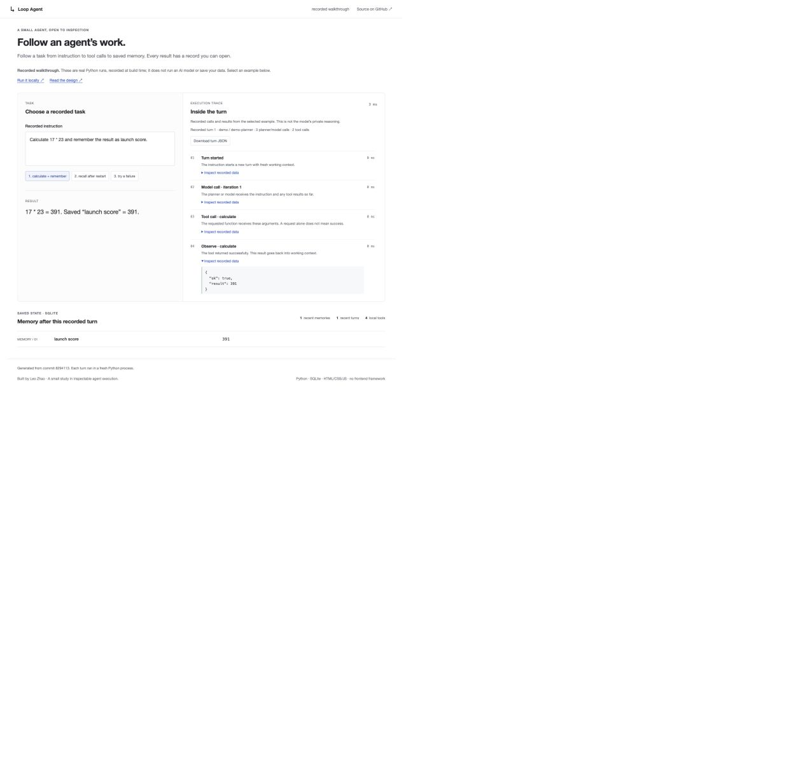
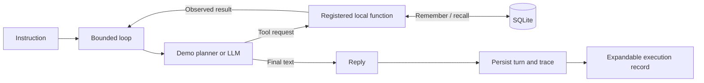

# Loop Agent

**An agent you can inspect: what it called, what came back, and what it remembered.**

A small Python project by [Leo Zhao](https://github.com/LobsterQBA). Give it a task such as
“calculate a number and remember it,” then expand the execution record to check the result.
Restart the app and retrieve the saved fact from SQLite.

**The design question:** how can a reader verify an agent's work instead of trusting its final answer?
Loop Agent makes the execution record part of the product: tool arguments, success or failure,
loop limits, and durable state are visible. The scope stays small enough to follow in source.

**[Open the interactive walkthrough →](https://lobsterqba.github.io/loop-agent/)**

No installation. Three recorded Python runs: save a result, recall it after restart, and inspect a failure.
The hosted page replays actual execution records; run locally to enter your own tasks.

[](https://github.com/LobsterQBA/loop-agent/actions/workflows/ci.yml)

[](https://lobsterqba.github.io/loop-agent/)

<details>
<summary><strong>Watch the three examples (short step-through GIF)</strong></summary>


Captured from the interactive replay, with pauses between examples; not a real-time LLM recording.

</details>

## Choose your depth

| Time | Start here | What you will see |
| --- | --- | --- |
| 30 seconds | This page | The problem, working example, and engineering choices |
| 3 minutes | [Run the demo](#try-it-locally) | A calculation, saved memory, and a checkable execution record |
| 5 minutes, no setup | [Annotated walkthrough](docs/walkthrough.md) | Expand each step, including a failure case |
| 10 minutes | [Architecture and tradeoffs](docs/architecture.md) | Source links, data flow, limits, and what would change for production |

## Try it locally

Requires **Python 3.11+** and Git. The default demo has **no dependencies, no API key, and no model charges**.
Use `python` instead of `python3` if that is your Python 3.11+ command.

```bash
git clone https://github.com/LobsterQBA/loop-agent.git
cd loop-agent
python3 -m agent_system
```

Open [localhost:8787](http://127.0.0.1:8787), then:

1. Run the prefilled instruction: **Calculate 17 × 23 and remember the result as launch score.**
   Expect **391**, **2 tool calls**, and **3 planner calls**.
2. Expand **Inspect recorded data** under a tool call and its observation. Compare the requested
   expression, returned number, and saved value. **Download turn JSON** exports that completed turn.
3. Stop the server with **Ctrl+C**, start it with the same command from the same directory, then click
   **recall memory** and run it. Expect `launch score: 391`; the database survived the restart.
4. Click **try a failure** and run it. Division by zero returns an error, and no result is saved.

No browser? Run the same core flow, including a restart check, in an isolated temporary database:

```bash
python3 -m agent_system.walkthrough
```

It exits with a nonzero status if an expected behavior fails. It does not touch your saved app state.
See the [walkthrough](docs/walkthrough.md) for expected output and troubleshooting.

## What this demonstrates

| Engineering choice | Why it matters | Evidence |
| --- | --- | --- |
| A readable tool loop | Separate a requested action from its observed result | [Loop](agent_system/agent.py), expandable UI trace |
| A deterministic demo and an optional LLM adapter | Make the project reproducible before adding model variability | [Adapters](agent_system/models.py), [walkthrough](agent_system/walkthrough.py) |
| Explicit SQLite memory | Show what persists; don't pretend a new turn remembers the conversation | [Store](agent_system/memory.py), restart check |
| Structured tool errors | A failed calculation must not become a saved result | [Regression tests](tests/test_agent.py) |
| A bounded tool surface | Explore agent control with four local functions | [Registry and calculator](agent_system/tools.py) |

The default planner uses rules, **not an LLM**. It runs real tools and writes real SQLite records.
Live mode uses the same loop with an OpenAI-compatible function-calling model. The trace records
calls and results; it does **not** expose private model reasoning. It appears after the turn completes,
not as a live stream.

## How a turn works



Each iteration asks the planner/model what to do next. A tool result becomes input to the next
iteration. A text reply ends the loop; a six-iteration budget prevents indefinite repetition.
A single iteration can request multiple tools, so this is not a six-tool-call or dollar-cost cap.

[Read the architecture](docs/architecture.md) for the full lifecycle, source map, and limitations.

<details>
<summary><strong>Optional: connect a live model</strong></summary>

```bash
python3 -m venv .venv
source .venv/bin/activate
pip install -e '.[live]'
cp .env.example .env
# Set AGENT_API_KEY and AGENT_MODEL in .env
loop-agent
```

On Windows, activate with `.venv\Scripts\activate`. Set `AGENT_BASE_URL` only if using another
OpenAI-compatible endpoint. Select **Live** in the app after restarting the server.
The API key stays on the server. The provider receives the instruction, tool schemas, and tool results;
provider fees apply. Demo tests do not establish live-model quality or provider compatibility.

</details>

<details>
<summary><strong>Optional: use the local JSON API</strong></summary>

```bash
curl -X POST http://127.0.0.1:8787/api/run \
  -H 'Content-Type: application/json' \
  -d '{"message":"Calculate 8 * 9","mode":"demo"}'
```

The response includes `reply`, `trace`, `iterations`, `tool_calls`, `mode`, `model`, and `turn_id`.
`GET /api/status` describes configuration; `GET /api/memory` returns up to 20 recent memories and
8 recent turn summaries. These are limited lists, not lifetime totals.

Requests require JSON (otherwise HTTP 415), a nonempty string of at most 2,000 characters, and mode
`demo` or `live`. Invalid input returns HTTP 400 before a turn is created. Unconfigured live mode
returns HTTP 409. State lives at `.agent-mini/state.db`, relative to the launch directory, unless
`AGENT_HOME` is set.

</details>

## Verify it

```bash
python3 -m venv .venv
source .venv/bin/activate
pip install -e '.[dev]'
pytest -q
ruff check .
python -m agent_system.walkthrough
```

CI runs the deterministic tests and walkthrough on Python 3.11 and 3.12. Tests cover multi-tool
execution, restart persistence, failed calculations, iteration exhaustion, restricted arithmetic,
and HTTP input validation. They do not benchmark LLM accuracy, latency, or production throughput.

## Hosting and presentation

The [GitHub Pages walkthrough](https://lobsterqba.github.io/loop-agent/) is generated from real demo
turns in fresh processes. It serves static assets and no API keys or visitor state.
[Build and deployment details](docs/hosting.md) · [Resume and interview notes](docs/presentation.md).

## Scope and next decisions

This is a local portfolio project, not a hosted service. There is no shell, browser, messaging,
or arbitrary-file tool. The server binds to localhost; it has no authentication or multi-user isolation.
Memory writes and the final trace are separate database transactions, so a failed turn can leave
partial effects. A provider failure can happen before a trace is saved.

The next engineering priority would be durable failure records and explicit turn status, followed
by live-model evaluation against task-specific criteria. See [the tradeoffs](docs/architecture.md#tradeoffs-and-next-decisions).

Architecture inspiration: [Waku](https://github.com/ShenSeanChen/waku-agent). This repository was
implemented from scratch with a smaller scope. [MIT license](LICENSE).
