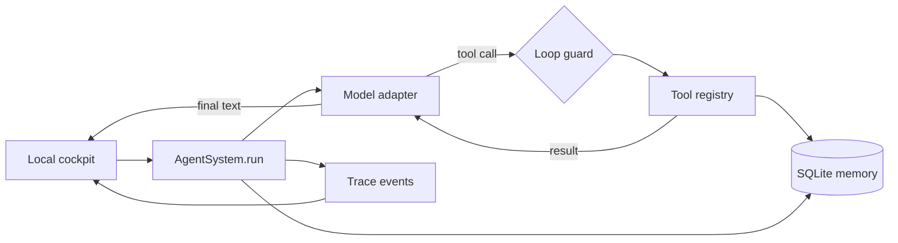

# Architecture notes

Loop Ledger keeps each layer behind one small interface:

## One turn

1. The server validates the instruction.
2. `AgentSystem` creates working messages and a trace.
3. The model returns either text or one or more tool calls.
4. The registry executes only registered functions and returns JSON data.
5. Tool results become new model messages.
6. The loop repeats until the model replies or the iteration limit is reached.
7. The turn and trace are written to SQLite.

## Deliberate constraints

- The server binds to `127.0.0.1`.
- There is no shell, browser, email, calendar, or network tool.
- Arithmetic uses a restricted AST evaluator, never Python `eval`.
- Demo mode is deterministic and makes no model request.
- Live mode keeps the API key in the Python process, never the browser.
- SQLite is the only durable source of truth.
