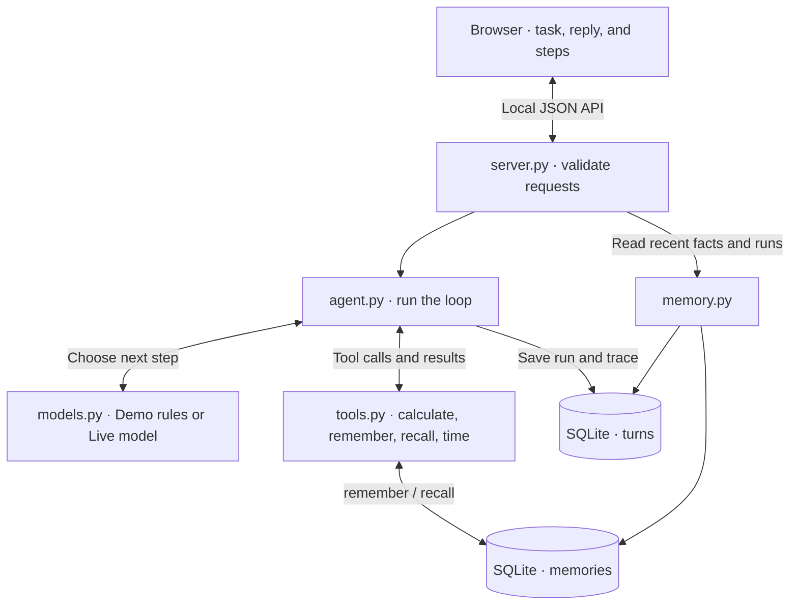
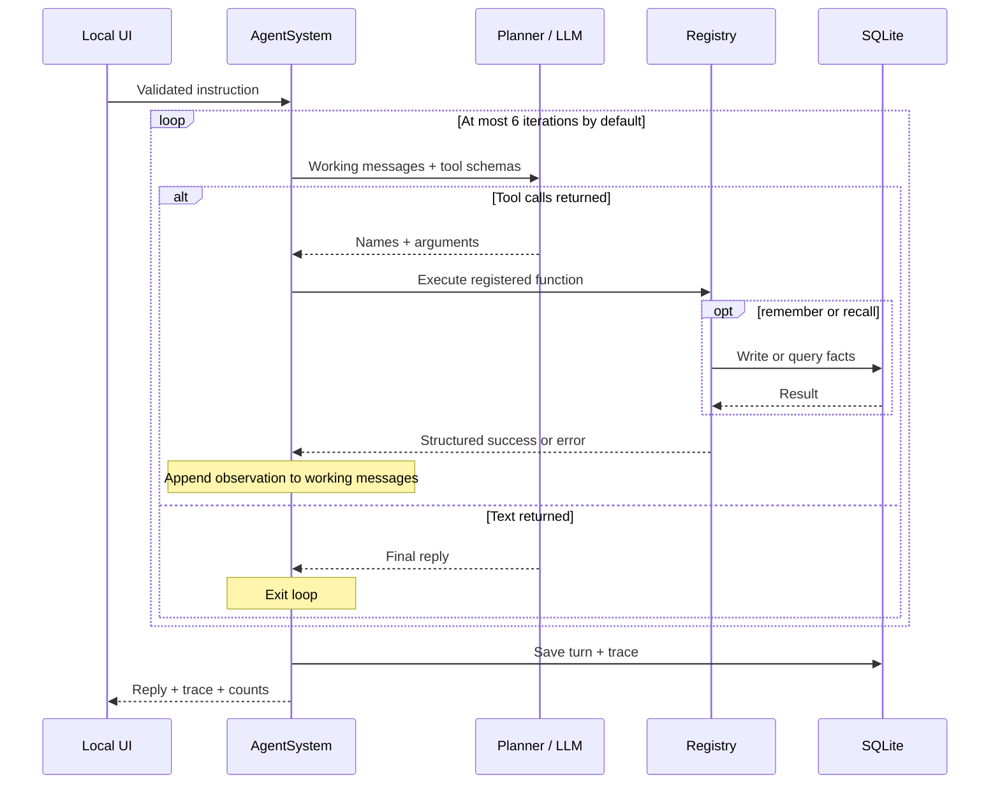
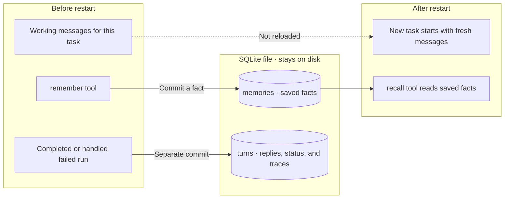

# Architecture

[← Project overview](../README.md) · [Step-by-step walkthrough](walkthrough.md)

The planner picks a tool, the registry runs it, and the result goes back to the planner.
The loop repeats until the planner replies or reaches its limit. Before a batch runs, the loop
rejects duplicate or conflicting tool-call IDs so an ambiguous model response cannot perform a
partial side effect. A matching ID retried in a later iteration reuses its recorded result. Each
call and result is recorded so you can see what happened.

## Components



Both tables live in one local database. The browser receives results from the Python server;
the optional Live model is called from the server too. The hosted browser demo instead loads
recorded JSON without running this backend.

## Source reading order

| File | Responsibility | Question to ask while reading |
| --- | --- | --- |
| [agent.py](../agent_system/agent.py) | One bounded turn | When does the loop continue, stop, and persist? |
| [models.py](../agent_system/models.py) | Demo and live adapters | What changes when fixed rules are replaced by an LLM? |
| [tools.py](../agent_system/tools.py) | Registry, schemas, execution | What can actually run, and how do errors return? |
| [evaluation.py](../agent_system/evaluation.py) | Deterministic trace checks | Is the recorded evidence internally consistent? |
| [memory.py](../agent_system/memory.py) | SQLite facts and turn records | Which state outlives the process? |
| [server.py](../agent_system/server.py) | HTTP validation and static assets | Where does external input enter? |
| [app.js](../agent_system/static/app.js) | Explanations and raw event disclosures | Can a reader distinguish a request from a successful result? |

## Lifecycle of one turn



The loop uses the same `Model.complete(messages, tools)` interface for both modes.
`DemoModel` recognizes a few patterns; it does not simulate LLM quality. `LiveModel` calls an
OpenAI-compatible chat-completions endpoint with function schemas. No model SDK is needed for demo mode.

An iteration is a model/planner call, not a tool call. Multiple tools returned in one iteration execute
sequentially only when the whole batch fits within the turn's remaining tool-call budget. The batch is
also preflighted for nonempty, unique call IDs and for conflicts with IDs seen earlier in the turn.
Serialized arguments are limited to 8 KiB per call so a model cannot put an unbounded payload into
the trace or tool boundary. Invalid batches are rejected before any of their tools run, which prevents
one model response from causing partial side effects before an identity or size error is discovered.
Tool results are limited to 16 KiB before they enter the model context or persisted trace. An oversized
result becomes a structured error with its original byte count and SHA-256 fingerprint, preserving
bounded diagnostic evidence without retaining the payload. The tool has already executed at this
point, so this output guardrail does not roll back side effects.
Text without tool calls ends the turn. Iteration exhaustion returns a guardrail reply and saves its
trace. The defaults are six iterations and 12 tool calls; the constructor clamps overrides to 1–12,
1–50, 256–65,536 argument bytes, and 256–262,144 output bytes respectively.

Within a turn, the loop keeps the result of each tool-call ID. If a provider repeats the same ID,
tool name, and arguments, the loop appends a `deduplicate` event and returns the first observation
without executing the tool again. Reusing an ID with different input fails and records the turn;
silently pairing new input with an old result would make the trace untrustworthy.

## What survives a restart



Facts and run records are separate writes. If a later step fails, a fact already saved can
remain. Old conversation messages are not automatically loaded into the next task.

## Stored data

| State | Lifetime | Detail |
| --- | --- | --- |
| Working messages | One turn | System instruction, user input, tool requests, and observations |
| Facts | Durable | Unique key; later writes replace its value; text normalized and length-limited |
| Turn ledger | Durable after completion or handled failure | User input, reply, mode, model, iterations, status, error, timestamp, JSON trace |
| UI trace | Current or selected recent turn | Reopen persisted traces, expand raw data, or export returned JSON; tool calls and observations carry matching call IDs; not streamed |
| Live API key | Server configuration | Not sent to the browser or stored in the turn ledger |

Facts and the ledger live in `.agent-mini/state.db` by default. Recall uses literal substring matching
with escaped SQL wildcard characters and parameterized values. It is not vector retrieval.
The memory endpoint returns capped recent lists. The UI labels these as recent counts and lets a
local user reopen the eight newest persisted traces. Existing databases are migrated in place with
`completed` status and `unknown` model provenance for their historical rows.

A `reason` event means “a model call is starting”; this legacy event name does not imply access to
private reasoning. A `done` event is assembled before the database write and returned only after that
write succeeds; its elapsed time does not measure the commit duration.

## Tradeoffs and next decisions

| Choice | Benefit | Cost / when to revisit |
| --- | --- | --- |
| Plain Python loop, no agent framework | Control flow fits in one file and is easy to inspect | More orchestration, retries, and cancellation would need explicit implementation |
| Keyless deterministic demo | Reproducible onboarding and regression checks | Limited language patterns; says nothing about live-model task success |
| SQLite instead of a service | No infrastructure setup; restart persistence is easy to verify | No multi-user isolation; concurrent writes and growth need more design |
| Explicit remember/recall tools | Clear distinction between working context and durable facts | Models may choose the wrong facts; no semantic retrieval or conflict resolution |
| Four local tools | Small, inspectable action surface | Narrow task usefulness; adding external writes would require permission and recovery policies |
| Completed or failed turn trace | Makes provider failures and partial tool effects inspectable | No progress streaming; a process crash or persistence failure can still leave no saved trace |

Failed turns now persist an explicit status, error, and the trace collected before the exception.
Memory writes still commit independently, so the trace provides evidence of partial effects rather
than rolling them back. A production design would need a transactional policy for those effects,
plus timeouts, retries, and cancellation before adding more tools. A process crash can still happen
before the failure record is committed.

After that, evaluate live mode with task-specific assertions (correct arithmetic, evidence-backed
memory writes, correct recall, bounded failure handling). Pin the model and configuration and report
success and failure counts. Deterministic tests are not an LLM benchmark.

## Boundaries worth reviewing

- HTTP input must be JSON, with a nonempty message of at most 2,000 characters. The request body is capped at 16,384 bytes.
- The calculator allows a restricted AST and rejects calls, names, complex results, nonfinite results,
  and results beyond its numeric bound. This is not a general code sandbox or CPU budget.
- Registered tool exceptions become `{ok: false, error: ...}` observations. Schemas describe inputs
  to the model, and the registry enforces the object constraints used here: required fields,
  primitive field types, and rejection of extra fields. It is not a full JSON Schema implementation.
- In demo mode, a failed calculation prevents a follow-on result write. The live model is instructed
  to inspect results, but there is no equivalent general write-policy enforcement.
- The server binds to `127.0.0.1`. It has no authentication, tenant isolation, or deployment hardening.
- Live mode sends working messages, schemas, and tool results to the configured provider. Locally
  stored instructions and facts are plain text in SQLite, not encrypted by this app.

## Verification map

| Behavior | Evidence |
| --- | --- |
| Calculation feeds the next memory write | `test_demo_agent_chains_calculate_and_remember` |
| Persistence survives fresh Python processes | `python -m agent_system.walkthrough` |
| Failed calculation is not saved; prior value survives | Failure regression tests in [test_agent.py](../tests/test_agent.py) |
| Endless tool requests stop | `test_iteration_guardrail_stops_endless_tool_calls` |
| An oversized tool batch is rejected before side effects | `test_tool_call_budget_rejects_oversized_batch_before_side_effects` |
| Duplicate IDs in one batch are rejected before side effects | `test_duplicate_ids_in_one_batch_are_rejected_before_side_effects` |
| Oversized tool arguments reject the whole batch before side effects | `test_oversized_tool_arguments_reject_the_batch_before_side_effects` |
| Oversized tool output is replaced before model context and persistence | `test_oversized_tool_output_is_replaced_before_it_reaches_model_context` |
| Provider failure after a write persists status, error, and partial-effect evidence | `test_failed_turn_is_persisted_with_partial_tool_effects` |
| Duplicate tool-call IDs do not repeat side effects | `test_duplicate_tool_call_id_reuses_result_without_repeating_side_effect` |
| Existing SQLite turn ledgers migrate with completed status | `test_memory_migrates_existing_turn_ledgers` |
| Completed and failed turns retain model provenance after reload | `test_local_api_runs_a_demo_turn`, `test_failed_agent_turn_returns_its_persisted_trace` |
| Restricted arithmetic and tool errors | [test_tools.py](../tests/test_tools.py) |
| Invalid tool arguments are rejected before the function runs | `test_tool_registry_validates_schema_before_execution` |
| Input validation and local API | [test_server.py](../tests/test_server.py) |
| Persisted traces can be reopened and unknown IDs return 404 | `test_local_api_runs_a_demo_turn`, `test_saved_turn_api_returns_not_found_for_unknown_or_invalid_id` |
| Turn status, trace steps, timing, non-empty call-to-observation identity, terminal event, and outcome are checked | [test_evaluation.py](../tests/test_evaluation.py) |
| Declared iteration and tool-call counts must match trace events | `test_declared_count_check_rejects_metadata_that_disagrees_with_trace` |

CI runs on Python 3.11 and 3.12. Browser layout, accessibility, provider compatibility, model quality,
and production load require separate validation; a green Python suite does not establish them.

## Local JSON API

```bash
curl -X POST http://127.0.0.1:8787/api/run \
  -H 'Content-Type: application/json' \
  -d '{"message":"Calculate 8 * 9","mode":"demo"}'
```

The response includes `reply`, `trace`, `iterations`, `tool_calls`, `mode`, `model`, `turn_id`, and
a deterministic `evaluation` of trace integrity. A passed trace means the evidence is structurally
consistent; it does not grade task correctness or answer quality.
`GET /api/status` describes configuration and the message, iteration, and tool-call limits.
`GET /api/memory` returns up to 20 recent memories and
8 recent turn summaries, rather than lifetime totals. `GET /api/turns/{id}` returns one persisted
turn with its full trace, or HTTP 404 when that turn does not exist.

Requests require JSON (otherwise HTTP 415), a nonempty string of at most 2,000 characters, and mode
`demo` or `live`. Invalid input returns HTTP 400 before a turn is created. Unconfigured live mode
returns HTTP 409. Set `AGENT_HOME` to change the state directory.
